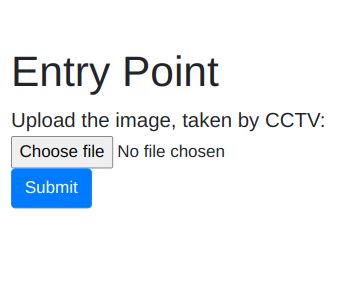
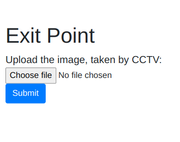
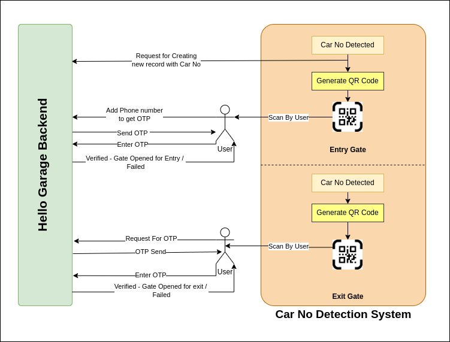

# Hello Garage

## Team Rollin' In
- Harsh Baid
- Purnadip Manna
- Ishika Ghosh
- Pratik Agarwal

____
## INDEX
____

1. [Tech-Stack](#1-tech-stack)
2. [Installation Process](#2-installation-process)
3. [Deployed Prototype](#3-deployed-prototype)
4. [Working Endpoints](#4-working-endpoints)
5. [Car No Detection System](#5-car-number-detection-system)
6. [Workflow](#6-workflow)
7. [Yet to Implement](#7-yet-to-implement)
8. [Future Plans](#8-future-plans)
____

## 1. Tech-Stack

## 2. Installation Process
1. Install Django

`pip install django`

2. Install Twilio

`pip install twilio`

3. Run the Server

`python manage.py runserver`

## 3. Deployed Prototype
We have deployed our project on Heroku and here is the link:
https://hello-garage-hg.herokuapp.com/

> Credential:
>
> Email: admin@gmail.com
>
> Password: password

## 4. Working Endpoints

**For Admin:**

- Landing Page (http://hello-garage-hg.herokuapp.com/)
- Admin Dashboard (http://hello-garage-hg.herokuapp.com/dashboard/)
> _*Garage's Admin have to log in first to go to Dashboard_
- Login (https://hello-garage-hg.herokuapp.com/user/login/)
- Admin Panel (http://hello-garage-hg.herokuapp.com/gapp/)
> Get all the informations of Vehicles which are currenty inside the Parking

**For End User:**

- Register Phone No with Car no (http://hello-garage-hg.herokuapp.com/gapp/update/\<carno>/\<garageid>)
> Open a page to enter Phone Number for OTP verification and registration of Phone Number on successfully verification.

- Verify OTP (http://hello-garage-hg.herokuapp.com/gapp/votp)
> Open a page to enter OTP and verification

**For Backend Operation Purpose:**
- New Entry of Vehicle (http://hello-garage-hg.herokuapp.com/gapp/newvehicle) [data ={ GarageID, NewCarNo }]
> This endpoint will be triggered by CarNoDetection System when a new car number will be detected at the front of the gate.

- Exit & Amount Calculation of a registerd Vehicle (http://hello-garage-hg.herokuapp.com/gapp/exitverify/\<carno>/\<garageid>)
> Fetch Details of registerd vehicle and send OTP to the registered Phone Number and redirect to OTP verification Page.

## 5. Car Number Detection System
- It is a separate system from our main Backend. It will be installed in every garage.
- Take snap of Car's front face at Entry Time.
- Detect Car Number.
- Send the Car Number to our main Backend to instantiate a record for new vehicle.
- Generate a QR (*Register Phone No with Car no*)
- After successful register, Gate of entry point will be opened.
- At the time of exit, Take snap of Car's front face.
- Generate a QR (*Exit & Amount Calculation of a registerd Vehicle*)
- After successful payment, Gate of exit point will be opened.

**Index:**

**Entry Time:**

**Exit Time:**

**After Submit Generate QR Code:**

## 6. Workflow

## 7. Yet to Implement
_*Due to shortage of time, some functionalities are yet to implement_
- Sign Up functionality (of Admin-Garage)
- Garage Profile
- All Parking Records of Garage
- Integrate payment gateway
- Live CCTV footage
- Get Garage Location using Map
- Give CCTV access to User to find perfect location for car parking

## 8. Future Plans
- Integrating both Private & Public Garages
- Install CCTVs in every slots to find the location of a specific vehicle very easily

## 
Thank You
